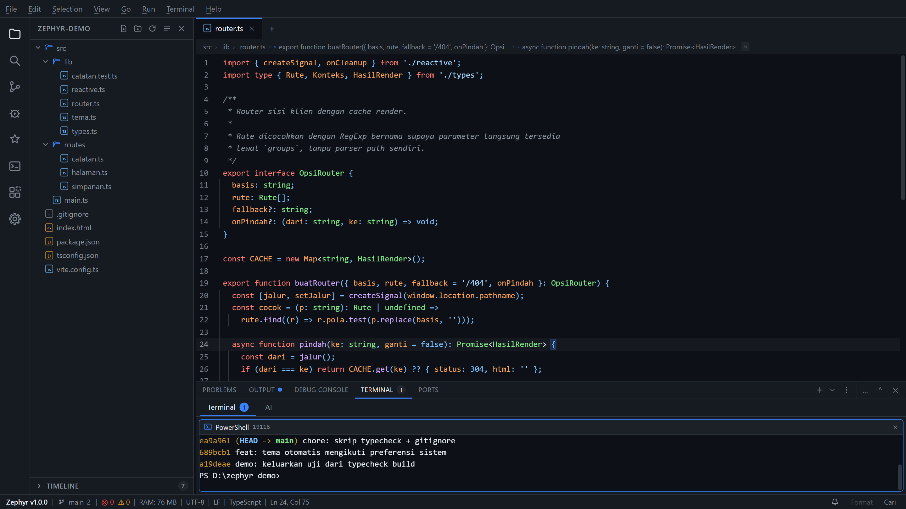
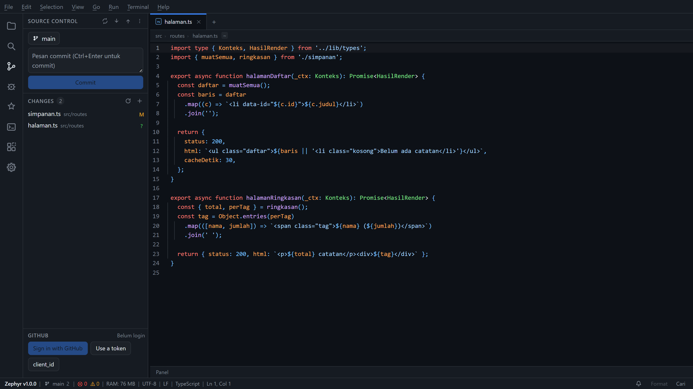
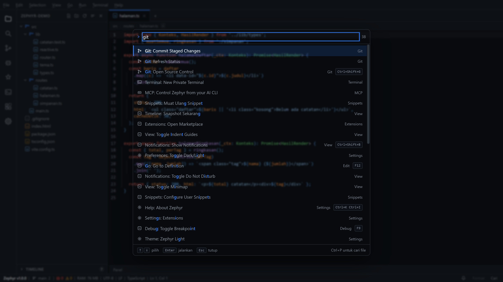

# Zephyr

**Code faster. Lighter. Yours.**

Code editor desktop untuk Windows, dibangun dari nol dengan Tauri 2 + React +
Rust. Bukan fork VS Code, bukan Electron.



## Kenapa ini ada

Gua mau editor yang rasanya seperti VS Code tapi tidak menyeret runtime browser
sendiri, dan yang bisa dikendalikan langsung oleh AI CLI yang sudah gua pakai
sehari-hari. Zephyr menjawab dua-duanya: satu proses Rust, WebView2 bawaan
Windows sebagai renderer, dan server MCP di port 9222 supaya Claude Code, Codex,
Gemini CLI, atau opencode bisa membaca dan mengubah isi jendelanya.

Installer NSIS-nya 5,6 MB dan MSI-nya 8,0 MB. Sebagai pembanding, installer
editor berbasis Electron biasanya 80–120 MB.

## Yang ada di dalamnya

**Editor** — CodeMirror 6. Tab multi-file, deteksi encoding (UTF-8, BOM,
Windows-1252, UTF-16), file di atas 4 MB masuk mode ringan baca-saja, find &
replace regex dengan batas langkah supaya pola katastrofik tidak menggantung UI.
Snippet memakai format VS Code apa adanya, jadi file snippet lama bisa disalin
langsung.

**Terminal** — sampai 6 pane per tab lewat ConPTY: PowerShell, cmd, pwsh, bash,
WSL. Ada Private Terminal yang scrollback-nya dihapus saat ditutup, pane khusus
AI agent CLI, dan browser pane dengan "Split With Browser".

**Source Control** — status, diff, stage, commit, branch, push/pull/sync, log.
Diff file biner dilabeli alih-alih memuntahkan byte mentah. Push saat remote
lebih baru menawarkan pull dulu, bukan menolak diam-diam.



**Language intelligence** — LSP per bahasa: completion, hover, go-to-definition,
diagnostics, rename. Debugger lewat DAP (js-debug) dengan breakpoint, step,
watch, dan call stack.

**AI Panel** — chat streaming dengan tiga adapter (OpenAI, Anthropic, Gemini),
katalog model berlogo. API key disimpan di sisi Rust; frontend hanya melihat
`hasKey` dan versi tersamar.

**MCP Server :9222** — HTTP JSON-RPC dengan Bearer token. 20+ method untuk
membaca pane, menulis ke terminal, membuka dan mengubah buffer editor, dan
menjalankan command palette. `editor_write` sengaja hanya menyentuh buffer, tidak
menulis ke disk — AI yang salah tidak bisa merusak file tanpa kamu menyimpannya.

**Command palette** — dua mode dalam satu modal: `Ctrl+Shift+P` untuk command,
`Ctrl+P` untuk file. Pencocokannya berlapis: prefix, awal kata, substring, lalu
subsequence.



**Sisanya** — global search lewat ripgrep, tasks runner dengan problem matcher,
local history + timeline, multi-root workspace dengan workspace trust, 7 tema,
CLI launcher (`zephyr .`, `--diff`, `--wait`), dan Settings 14 section dengan
shortcut yang bisa di-remap beserta deteksi konflik.

## Aksesibilitas

Bukan tempelan. Fase terakhir seluruhnya soal ini:

- Kontras WCAG AA untuk teks di **7 tema** — 29 token digeser sampai lolos,
  diverifikasi oleh `scripts/a11y-kontras.mjs` yang mengukur nilai hex final,
  bukan float.
- Tema **High Contrast** memenuhi AAA: 23/23 pasangan warna, teks utama 21:1.
- Keyboard-only: focus trap di semua dialog modal, skip link sebagai elemen
  fokusabel pertama, focus ring dua lapis lewat `:focus-visible`.
- Screen reader: satu live region untuk seluruh app, `screenReaderMode` xterm,
  dan nama aksesibel untuk area editor CodeMirror.
- `prefers-reduced-motion` dihormati, plus setelan aplikasi terpisah.
- axe-core dijalankan pada dokumen hidup di WebView2 — 0 pelanggaran.

## Kondisi jujur

Yang **belum** ada: SSH remote (ditunda sampai ada hosting untuk mengujinya).

Marketplace ekstensi masih terbatas: ekstensi v1 **hanya membaca manifest**, kode
JS-nya tidak dijalankan. Itu keputusan keamanan, bukan kemalasan — mengeksekusi
JS ekstensi berarti memberi pihak ketiga akses penuh ke `window`, artinya ke
seluruh IPC termasuk fs, pty, git, dan secrets.

Installer tidak ditandatangani, jadi SmartScreen akan memperingatkan saat
pertama kali dijalankan.

API key disimpan dengan XOR + kunci BLAKE3 dari MachineGuid. Itu **obfuskasi,
bukan enkripsi** — cukup untuk mencegah key terbaca sekilas, tidak cukup
melindungi dari orang yang sudah memegang akun Windows kamu. Lihat
[SECURITY.md](SECURITY.md).

## Bangun dari sumber

```bash
npm install
npm run tauri dev          # mode dev
npm run tauri build        # MSI + NSIS di src-tauri/target/release/bundle/
```

Butuh Rust stable, Node 20+, dan WebView2 Runtime (sudah ada di Windows 11).

## Verifikasi

Verifikasi tidak "dianggap lulus" — tiap fase dibuktikan dari DOM dan state yang
hidup lewat Chrome DevTools Protocol:

```bash
npm run dev                # terminal 1

# terminal 2 — app dengan port debug WebView2
cd src-tauri
WEBVIEW2_ADDITIONAL_BROWSER_ARGUMENTS="--remote-debugging-port=9223" \
  ./target/debug/zephyr.exe

npm run verify:31          # terminal 3
```

Harness ada di `scripts/verify*.mjs`. Unit test Rust: `cd src-tauri && cargo test
--lib` (148 test). Screenshot di README ini juga dihasilkan dari app hidup lewat
`scripts/shot.mjs`, bukan mockup.

## Lisensi

Tidak dilisensikan. Semua hak dipegang pemilik repositori.

Tidak ada telemetri, tidak ada analytics, tidak ada crash reporting otomatis. Log
dan settings hanya ada di `%APPDATA%\zephyr\`.
