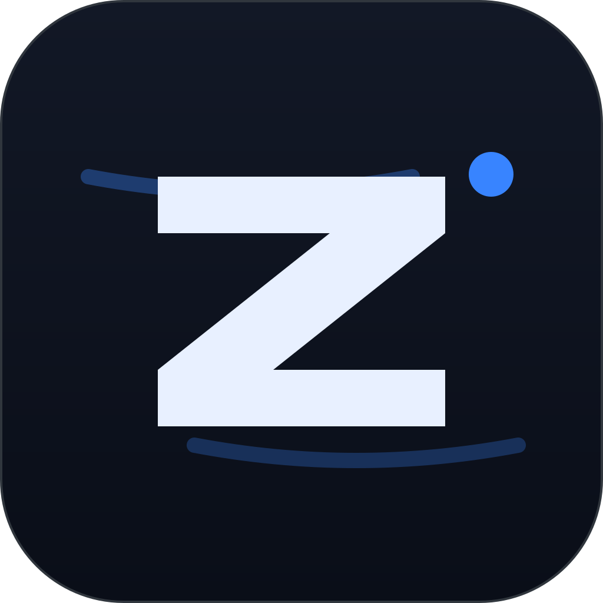
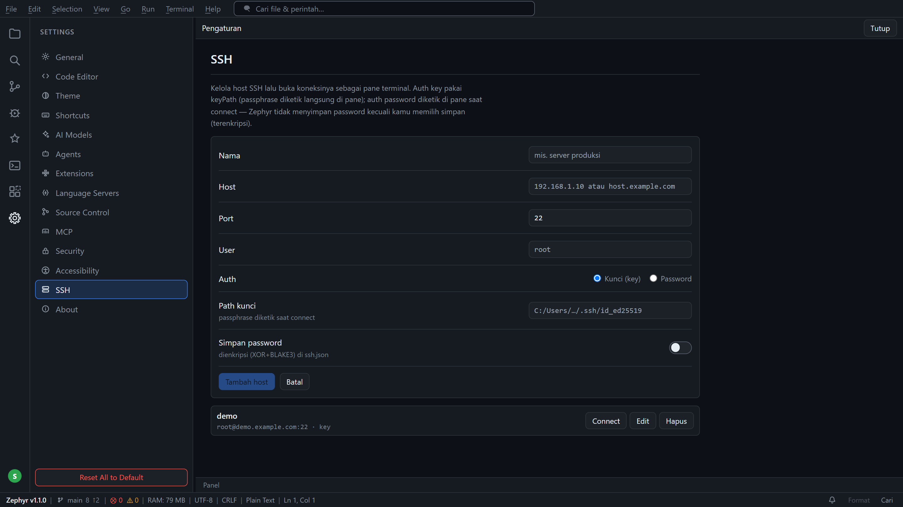
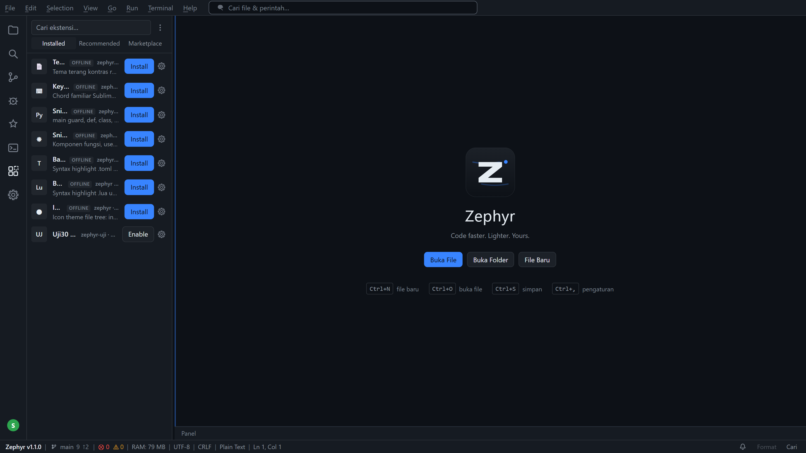

<div align="center">



# Zephyr

**Code faster. Lighter. Yours.**

Code editor desktop untuk Windows, dibangun dari nol dengan Tauri 2 + React +
Rust. Bukan fork VS Code, bukan Electron.

`v1.1.5` · Tauri 2 · React 18 · TypeScript · Rust

</div>


## Kenapa ini ada

Gua mau editor yang rasanya seperti VS Code tapi tidak menyeret runtime browser
sendiri, dan yang bisa dikendalikan langsung oleh AI CLI yang sudah gua pakai
sehari-hari. Zephyr menjawab dua-duanya: satu proses Rust, WebView2 bawaan
Windows sebagai renderer, dan server MCP di port 9222 supaya Claude Code, Codex,
Gemini CLI, atau opencode bisa membaca dan mengubah isi jendelanya.

Installer NSIS-nya 5,6 MB dan MSI-nya 8,0 MB. Sebagai pembanding, installer
editor berbasis Electron biasanya 80–120 MB.

## Instal

Butuh **Windows 10/11** (WebView2 Runtime sudah ada di Windows 11, jadi biasanya
langsung jalan tanpa install tambahan).

### Cara install Zephyr (3 langkah)

1. **Unduh installer** — `Zephyr_1.1.5_x64-setup.exe` (atau `.msi`) dari
   halaman [Releases](https://github.com/ShinRyu04/Zephyr/releases). Cari file
   `Zephyr_1.1.5_x64-setup.exe` — itu installer-nya.
2. **Jalankan installer** — kalau SmartScreen muncul, klik **More info → Run
   anyway**. Ini normal: installer belum ditandatangani, bukan berarti
   berbahaya. Source-nya terbuka dan bisa diverifikasi.
3. **Selesai** — Zephyr terbuka. Di sidebar kiri klik **Open Folder** untuk
   membuka proyekmu, atau **Open File** untuk file tunggal.

Tidak perlu install apa pun tambahan — Rust, Node, dan WebView2 sudah ditangani
installer. Data dan settings tersimpan di `%APPDATA%\zephyr\`.

### Cara install ekstensi (2 cara)

**Dari Marketplace:**
1. Buka panel **Extensions** (ikon kotak-kotak di sidebar kiri, atau
   `Ctrl+Shift+X`).
2. Tab **Marketplace** → ketik nama ekstensi di kotak cari → klik **Install**
   pada hasil yang kamu mau.
3. Zephyr mengunduh `.vsix` langsung dari **Open VSX** — jadi ekstensi VS Code
   publik yang tersedia di sana ikut tersedia.

**Dari file `.vsix` manual:**
1. Unduh file `.vsix` dari mana pun (halaman rilis ekstensi, Open VSX, dll).
2. Di panel Extensions, klik tombol **⋯** (pojok kanan header) →
   **Install from .vsix…** → pilih filenya.
3. Selesai — ekstensi muncul di tab **Installed** dan bisa diaktifkan/dimatikan.

> **Catatan penting soal ekstensi:** ekstensi v1 bersifat **manifest-only** —
> Zephyr membaca `package.json` dan mendaftarkan `contributes.commands` ke
> Command Palette, tetapi **tidak menjalankan kode JS ekstensi**. Bahasa, tema,
> snippet, keymap, dan command ikut aktif; extension host penuh (kode JS
> ekstensi) sengaja tidak dijalankan demi keamanan.

### Cara pakai SSH ke server/VPS

1. Buka **Settings → SSH** (atau panel terminal → dropdown Connect SSH).
2. Klik **+ Tambah host** — isi nama, host (IP/domain), port (default 22),
   user, dan metode auth (kunci SSH atau password).
3. Klik **Connect** — terbuka pane terminal yang terhubung ke server. Ketik
   password/passphrase langsung di pane kalau diminta.
4. Untuk memutuskan: klik **X** di header pane, atau kanan-klik pane →
   **Disconnect**.

Data dan settings disimpan di `%APPDATA%\zephyr\` — hapus folder itu untuk
reset penuh.



## Yang ada di dalamnya

**Editor** — CodeMirror 6. Tab multi-file, deteksi encoding (UTF-8, BOM,
Windows-1252, UTF-16), file di atas 4 MB masuk mode ringan baca-saja, find &
replace regex dengan batas langkah supaya pola katastrofik tidak menggantung UI.
Snippet memakai format VS Code apa adanya, jadi file snippet lama bisa disalin
langsung.

**Terminal** — sampai 6 pane per tab lewat ConPTY: PowerShell, cmd, pwsh, bash,
WSL. Ada Private Terminal yang scrollback-nya dihapus saat ditutup, pane khusus
AI agent CLI, dan browser pane dengan "Split With Browser".

**SSH** — kelola daftar host (nama, host, port, user, auth key/password) di
Settings → SSH, lalu buka koneksinya sebagai pane terminal biasa. Password
hanya disimpan bila kamu memilih "simpan", dan itu pun terenkripsi (XOR+BLAKE3)
di `ssh.json`, bukan plaintext.

**Source Control** — status, diff, stage, commit, branch, push/pull/sync, log.
Diff file biner dilabeli alih-alih memuntahkan byte mentah. Push saat remote
lebih baru menawarkan pull dulu, bukan menolak diam-diam.


**Language intelligence** — LSP per bahasa: completion, hover, go-to-definition,
diagnostics, rename. Debugger lewat DAP (js-debug) dengan breakpoint, step,
watch, dan call stack.

**AI Panel** — chat streaming dengan tiga adapter (OpenAI, Anthropic, Gemini),
katalog model berlogo. API key disimpan di sisi Rust; frontend hanya melihat
`hasKey` dan versi tersamar.

**MCP Server :9222** — HTTP JSON-RPC dengan Bearer token. 20+ method untuk
membaca pane, menulis ke terminal, membuka dan mengubah buffer editor, dan
menjalankan command palette. `editor_write` sengaja hanya menyentuh buffer, tidak
menulis ke disk — AI yang salah tidak bisa merusak file tanpa kamu menyimpannya.

**Command palette** — dua mode dalam satu modal: `Ctrl+Shift+P` untuk command,
`Ctrl+P` untuk file. Pencocokannya berlapis: prefix, awal kata, substring, lalu
subsequence.


**GitHub login** — login akun GitHub lewat device flow (browser), tampil sebagai
avatar di pojok kiri bawah, dipakai untuk push/pull tanpa repot credential.

**Split editor** — bagi editor jadi dua grup (View → Split Editor Right,
`Ctrl+\`), tiap grup punya tab bar sendiri, gabungkan kembali kapan saja.

**Ekstensi & Marketplace** — cari & pasang ekstensi dari Open VSX langsung di
panel Extensions, lengkap dengan logo asli; atau install `.vsix` manual dari
folder.



**Notifikasi update** — Zephyr bisa memeriksa rilis baru dari dalam app
(Settings → Tentang → Cek update) dan memasangnya sendiri. Aktifkan "Cek
pembaruan otomatis" di Settings → General: tiap app dibuka, Zephyr cek
sendiri dan muncul notifikasi di lonceng kalau ada versi baru — klik "Lihat
& pasang" langsung beres. Saat update selesai ada pemberitahuan, setelah
restart muncul banner "Zephyr diperbarui ke vX" dengan catatan rilis, dan
info bug/berita tampil lewat Notification Center (lonceng di status bar).

**Menu bar lengkap** — File / Edit / Selection / View / Go / Run / Terminal /
Help semuanya aktif: undo-redo, cut-copy-paste, komentar, seleksi multi-kursor,
toggle breadcrumbs/minimap/sticky scroll, ganti tema, lompat antar error,
riwayat tab (Go → Back/Forward), reopen editor yang ditutup, buka jendela
baru, dan keluar. Semua item juga tersedia di Command Palette
(`Ctrl+Shift+P`).

**Sisanya** — global search lewat ripgrep, tasks runner dengan problem matcher,
local history + timeline, multi-root workspace dengan workspace trust, 7 tema
(+ Senja), CLI launcher (`zephyr .`, `--diff`, `--wait`), dan Settings 14
section dengan shortcut yang bisa di-remap beserta deteksi konflik.

## Aksesibilitas

Bukan tempelan. Fase terakhir seluruhnya soal ini:

- Kontras WCAG AA untuk teks di **7 tema** — 29 token digeser sampai lolos,
  diverifikasi oleh `scripts/a11y-kontras.mjs` yang mengukur nilai hex final,
  bukan float.
- Tema **High Contrast** memenuhi AAA: 23/23 pasangan warna, teks utama 21:1.
- Keyboard-only: focus trap di semua dialog modal, skip link sebagai elemen
  fokusabel pertama, focus ring dua lapis lewat `:focus-visible`.
- Screen reader: satu live region untuk seluruh app, `screenReaderMode` xterm,
  dan nama aksesibel untuk area editor CodeMirror.
- `prefers-reduced-motion` dihormati, plus setelan aplikasi terpisah.
- axe-core dijalankan pada dokumen hidup di WebView2 — 0 pelanggaran.

## Kondisi jujur

Marketplace ekstensi masih terbatas: ekstensi v1 **hanya membaca manifest**, kode
JS-nya tidak dijalankan. Itu keputusan keamanan, bukan kemalasan — mengeksekusi
JS ekstensi berarti memberi pihak ketiga akses penuh ke `window`, artinya ke
seluruh IPC termasuk fs, pty, git, dan secrets.

Installer tidak ditandatangani, jadi SmartScreen akan memperingatkan saat
pertama kali dijalankan.

Auto-update dalam aplikasi aktif: tombol "Cek update" di Settings → Tentang
memeriksa GitHub Releases dan memasang versi baru langsung dari app. Artefak
update ditandatangani dengan kunci minisign Zephyr; versi lama menemukan
versi baru ini lewat `latest.json`.

API key disimpan dengan XOR + kunci BLAKE3 dari MachineGuid. Itu **obfuskasi,
bukan enkripsi** — cukup untuk mencegah key terbaca sekilas, tidak cukup
melindungi dari orang yang sudah memegang akun Windows kamu. Lihat
[SECURITY.md](SECURITY.md).

## Bangun dari sumber

```bash
npm install
npm run tauri dev          # mode dev
npm run tauri build        # MSI + NSIS di src-tauri/target/release/bundle/
```

Butuh Rust stable, Node 20+, dan WebView2 Runtime (sudah ada di Windows 11).

## Verifikasi

Verifikasi tidak "dianggap lulus" — tiap fase dibuktikan dari DOM dan state yang
hidup lewat Chrome DevTools Protocol:

```bash
npm run dev                # terminal 1

# terminal 2 — app dengan port debug WebView2
cd src-tauri
WEBVIEW2_ADDITIONAL_BROWSER_ARGUMENTS="--remote-debugging-port=9223" \
  ./target/debug/zephyr.exe

npm run verify:31          # terminal 3
```

Harness ada di `scripts/verify*.mjs`. Unit test Rust: `cd src-tauri && cargo test
--lib` (148 test). Screenshot di README ini juga dihasilkan dari app hidup lewat
`scripts/shot.mjs`, bukan mockup.

## Lisensi

Tidak dilisensikan. Semua hak dipegang pemilik repositori.
