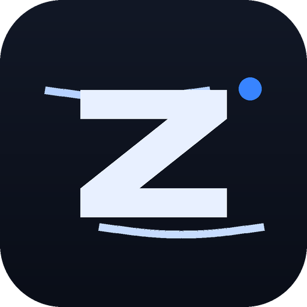

<div align="center">
  
</div>

# Zephyr

Code faster. Lighter. Yours.

Zephyr adalah **code editor desktop buatan sendiri** — nyaman seperti
VS Code, tapi lebih lengkap dan lebih ringan (RAM idle < 400 MB,
startup < 3 detik). Dibangun dari nol dengan **Tauri 2 + React**.

## Fitur Utama

- **Editor modern**: tab, syntax highlight, find & replace, multi-cursor,
  autocomplete, restore session.
- **Explorer & Search** di workspace dengan file watcher real-time.
- **Terminal multi-pane** (sampai 6 pane per tab):
  - Shell biasa & **Private Terminal**
  - **AI Agent Terminal**: spawn opencode / Claude CLI / Codex / Gemini
    CLI / Grok / Pi / GitHub Copilot langsung di dalam pane; klik lagi
    untuk duplikat.
  - **Browser Pane** (Split With Browser).
- **SSH Connections** untuk remote work.
- **Settings lengkap**: General, Code Editor, Theme, Shortcuts, Models,
  Agents, Extensions, Source Control, MCP, About.
- **AI Panel** multi-provider dengan **logo model yang sesuai**
  (Gemini, OpenAI, Anthropic, DeepSeek, opencode, custom): chat streaming
  kata per kata, render markdown + blok kode, lampirkan file aktif sebagai
  konteks (maks 12 KB), tombol **Jalankan di Terminal** untuk jawaban yang
  memuat perintah shell — perintah berisiko wajib dikonfirmasi dulu —
  tombol Stop di tengah jawaban, dan riwayat chat yang pulih setelah app
  ditutup. API key per provider disimpan Rust; UI cuma melihat mask.
- **Source Control** (git): status, diff, commit, branch, push/pull.
- **MCP Server port 9222**: AI CLI luar (Claude Code, Codex, Gemini CLI,
  opencode, Copilot CLI, Cursor) bisa **membaca dan mengendalikan**
  Zephyr — panes, terminal, editor, settings, extensions, screenshot,
  run command. Ada tombol on/off.
- **6 tema** (Dark/Light/Nord/Tokyo Night/Gruvbox/One Dark).

## Persyaratan

- Windows 10 22H2+ (64-bit)
- WebView2 Runtime (bawaan Windows 11 / update Windows 10)
- `git` (untuk Source Control)
- OpenSSH Client (opsional, untuk SSH)
- CLI agent (opencode/Claude/etc.) — opsional, untuk Agent Terminal

## Install

Rilis v1.0.0 menyediakan:
- `Zephyr_1.0.0_x64_en-US.msi` — installer MSI
- `Zephyr_1.0.0_x64-setup.exe` — installer NSIS (setup/portable)

## Build dari sumber

```powershell
npm install
npm run tauri dev     # mode pengembangan
npm run tauri build   # rilis (MSI + NSIS)
```

Data Anda tersimpan aman di `%APPDATA%\zephyr\`.

## Mengisi API key model AI

Buka **Settings → Model AI**, pilih provider, tempel key-nya. Key ditulis
oleh Rust ke `%APPDATA%\zephyr\secrets.json` (terenkripsi dengan kunci
turunan mesin ini) — **bukan** ke `settings.json`, dan tidak pernah dikirim
ke UI: frontend hanya menerima status `hasKey` + mask seperti `sk-…4f2a`.

Punya server model sendiri? Pilih provider *Lokal (opencode / loopback)*
lalu arahkan base URL ke server OpenAI-compatible milik Anda (LM Studio,
Ollama, llama.cpp, vLLM), misal `http://127.0.0.1:1234/v1`.

## Menghubungkan AI CLI ke Zephyr (MCP port 9222)

Buka **Settings → MCP**, nyalakan switch besarnya. Zephyr jadi server
JSON-RPC 2.0 di `http://127.0.0.1:9222` — loopback saja, tidak pernah terbuka
ke jaringan — dan setiap permintaan wajib membawa
`Authorization: Bearer <token>`. Tokennya di-generate sekali ke
`%APPDATA%\zephyr\mcp.json`; tombol mata untuk melihatnya, Copy untuk
menyalin, "Token baru" kalau mau mencabut akses lama.

Centang CLI yang mau didaftari lalu tekan **Tulis ke CLI**. Zephyr menyisipkan
entri `zephyr` ke config masing-masing (`~/.claude.json`,
`~/.codex/config.toml`, `~/.gemini/settings.json`,
`~/.config/opencode/opencode.json`, `~/.copilot/mcp-config.json`,
`~/.cursor/mcp.json`, `Startup/.mcp.json`) — key lain di file itu tidak
disentuh, dan versi lamanya selalu disalin ke `<nama>.bak` dulu.

Cek cepat tanpa CLI apa pun:

```powershell
curl http://127.0.0.1:9222/health
curl -H "Authorization: Bearer <token>" http://127.0.0.1:9222/mcp
```

18 tool tersedia: `list_panes`, `list_editors`, `get_window`, `get_settings`,
`list_extensions`, `terminal_write`, `terminal_key`, `pane_new`, `pane_close`,
`editor_open`, `editor_write`, `editor_insert`, `editor_close`, `run_command`,
`screenshot_pane`, `set_setting`, dan dua alias. Dua batasan yang saya sebut
apa adanya: **`editor_write`/`editor_insert` hanya mengubah buffer tab, tidak
menulis ke disk** (menyimpan tetap keputusan Anda), dan `set_setting` dibatasi
whitelist tampilan/editor — kredensial serta setting MCP sendiri tidak bisa
diubah dari luar. Yang perlu Anda sadari: selama tahu tokennya, apa pun yang
berjalan sebagai akun Anda bisa mengemudikan jendela ini.

## Catatan: Private Terminal (jujur, apa adanya)

Private Terminal bukan sandbox dan bukan sesi user lain. Yang benar-benar
dilakukan Zephyr:

- shell dijalankan dengan `-NoProfile` (profil PowerShell Anda tidak dimuat),
- `Set-PSReadLineOption -HistorySaveStyle SaveNothing` — perintah yang Anda
  ketik **tidak ditulis** ke `ConsoleHost_history.txt` milik akun Anda
  (diverifikasi otomatis di `npm run verify:05`, V6a),
- env `ZEPHYR_PRIVATE=1` supaya skrip Anda bisa mendeteksi mode ini,
- scrollback pane dihapus dari memori saat tab ditutup.

Yang **tidak** dilakukan: mengganti user Windows, mengisolasi filesystem,
atau menyembunyikan proses. Perintah tetap berjalan sebagai akun Anda dan
tetap bisa terlihat di Task Manager / event log sistem. Untuk sesi yang
benar-benar bersih, gunakan akun Windows terpisah.

## Dokumentasi

- PRD: `Zephyr PRD.md`
- Panduan agen AI: `AGENTS.md`
- Buglog: `BUGLOG.md` (setelah fase 15)
- Laporan build: `BUILD_REPORT.md` (setelah fase 17)
- `CHANGELOG.md` · `RELEASE_NOTES.md`

## Roadmap

v1.1: Marketplace ekstensi, LSP/IntelliSense lebih dalam, SFTP, updater.
v1.2: Kolaborasi (opsional).

---

Dibuat untuk dipakai sendiri, dengan bantuan AI. MIT License.<br>
Logo *Zephyr* — angin yang ringan, tapi kencang. 💨
